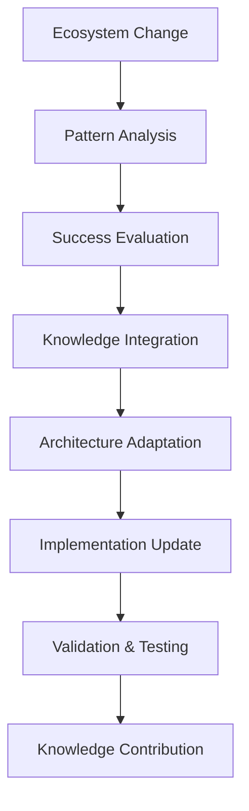

# Evolutionary Adaptation Capabilities

## Overview
This module enables the VS Code SDK Integration Agent to evolve and adapt dynamically as the OpenAgentBuilder ecosystem grows and changes, supporting the "on-the-fly" evolution mentioned in system requirements.

## Core Evolutionary Features

### Adaptive Architecture
- **Self-Modifying Structure**: Dynamically adjust integration architecture based on ecosystem evolution
- **Pattern Evolution**: Learn and evolve integration patterns from successful implementations
- **Capability Expansion**: Automatically expand capabilities to support new agent types and features
- **Protocol Adaptation**: Adapt communication protocols as the agent ecosystem evolves
- **Quality Evolution**: Continuously evolve quality standards based on system maturity

### Learning Mechanisms


### Memory-Enhanced Evolution
- **Historical Context**: Leverage development session history to understand evolution patterns
- **Success Patterns**: Apply proven evolutionary approaches from institutional memory
- **Decision Continuity**: Maintain alignment with established architectural decisions during evolution
- **Quality Preservation**: Ensure evolution maintains and enhances quality standards
- **Knowledge Building**: Contribute evolutionary insights back to institutional memory

## Evolutionary Strategies

### Predictive Adaptation
- **Trend Analysis**: Analyze OpenAgentBuilder development trends to predict future requirements
- **Capability Forecasting**: Predict new capabilities needed based on ecosystem evolution
- **Resource Planning**: Forecast resource requirements for anticipated changes
- **Risk Assessment**: Assess risks associated with predicted evolutionary changes
- **Preparation Strategies**: Prepare integration architecture for anticipated evolution

### Reactive Evolution
```markdown
**New Agent Pattern Detected**
1. Analyze new agent structure and capabilities
2. Query memory for similar historical patterns
3. Assess integration complexity and requirements
4. Develop new integration approach
5. Test and validate new integration pattern
6. Document pattern for future use

**Ecosystem Architecture Change**
1. Detect changes in overall system architecture
2. Assess impact on VS Code integration approach
3. Plan adaptation strategy using proven methods
4. Execute architectural evolution incrementally
5. Validate evolution maintains quality standards
6. Update institutional knowledge with insights

**Technology Evolution**
1. Monitor VS Code platform evolution and new features
2. Assess opportunities for enhanced integration
3. Plan integration feature expansion
4. Implement new integration capabilities
5. Validate enhanced integration quality
6. Share evolution approach with ecosystem
```

### Proactive Enhancement
- **Opportunity Identification**: Identify opportunities for integration enhancement
- **Innovation Testing**: Test innovative integration approaches in controlled environments
- **Feature Anticipation**: Anticipate future VS Code features and prepare integration strategies
- **Performance Optimization**: Continuously optimize integration performance
- **User Experience Evolution**: Evolve integration to improve developer experience

## Self-Improvement Mechanisms

### Automated Learning Loops
```yaml
Learning_Cycle:
  frequency: continuous
  process:
    - monitor_ecosystem_changes
    - analyze_integration_performance
    - identify_improvement_opportunities
    - query_institutional_memory
    - design_enhancement_strategies
    - implement_improvements
    - validate_enhancements
    - update_knowledge_base

Performance_Evolution:
  frequency: weekly
  process:
    - analyze_performance_metrics
    - compare_with_historical_baselines
    - identify_performance_bottlenecks
    - research_optimization_strategies
    - implement_performance_improvements
    - measure_improvement_impact
    - document_optimization_approaches

Quality_Enhancement:
  frequency: daily
  process:
    - monitor_integration_quality_metrics
    - detect_quality_degradation_patterns
    - analyze_root_causes
    - apply_proven_quality_improvements
    - implement_quality_enhancements
    - validate_quality_improvements
    - contribute_insights_to_knowledge_base
```

### Capability Self-Assessment
- **Integration Effectiveness**: Continuously assess integration effectiveness and identify gaps
- **Feature Coverage**: Evaluate coverage of OpenAgentBuilder features in VS Code integration
- **Performance Baseline**: Maintain performance baselines and track improvement over time
- **Quality Metrics**: Track quality metrics and identify areas for enhancement
- **User Satisfaction**: Monitor user experience and identify improvement opportunities

## Ecosystem Integration

### Cross-Agent Learning
- **Agent Collaboration**: Learn from other agents' evolutionary approaches
- **Pattern Sharing**: Share successful evolutionary patterns with other agents
- **Collective Intelligence**: Contribute to and benefit from collective ecosystem intelligence
- **Best Practice Propagation**: Propagate evolutionary best practices across the ecosystem
- **Coordinated Evolution**: Coordinate evolutionary changes with other system components

### Knowledge Ecosystem Participation
- **Development Session Contribution**: Contribute evolutionary insights to development sessions
- **Decision Log Integration**: Integrate evolutionary decisions into institutional decision log
- **Pattern Library Enhancement**: Enhance pattern library with evolutionary approaches
- **Quality Standard Evolution**: Participate in evolution of system quality standards
- **Architectural Principle Refinement**: Contribute to refinement of architectural principles

## Future-Proofing Strategies

### Architectural Flexibility
- **Modular Evolution**: Evolve individual modules independently while maintaining system cohesion
- **Interface Stability**: Maintain stable interfaces while allowing internal evolution
- **Backward Compatibility**: Ensure evolutionary changes maintain backward compatibility
- **Migration Support**: Provide smooth migration paths for evolutionary changes
- **Version Management**: Manage multiple versions during evolutionary transitions

### Technology Adaptation
```markdown
**VS Code Platform Evolution**
1. Monitor VS Code release cycles and feature announcements
2. Assess impact of new VS Code features on integration opportunities
3. Plan integration evolution to leverage new platform capabilities
4. Test integration with VS Code preview releases
5. Prepare evolution roadmap aligned with VS Code development

**OpenAgentBuilder Framework Evolution**
1. Participate in OpenAgentBuilder architectural discussions
2. Anticipate framework changes and their integration implications
3. Prepare adaptation strategies for framework evolution
4. Test integration compatibility with framework preview versions
5. Contribute integration requirements to framework evolution planning
```

### Continuous Improvement Culture
- **Innovation Mindset**: Foster culture of continuous innovation and improvement
- **Experimentation Framework**: Provide safe framework for testing evolutionary approaches
- **Learning Organization**: Build organizational learning capabilities for continuous evolution
- **Knowledge Sharing**: Promote knowledge sharing across the evolutionary process
- **Failure Learning**: Learn from evolutionary failures to improve future adaptation

## Quality Assurance for Evolution

### Evolutionary Testing
- **Evolution Validation**: Comprehensive testing of evolutionary changes
- **Regression Prevention**: Prevent regression during evolutionary adaptation
- **Performance Impact**: Assess performance impact of evolutionary changes
- **Integration Integrity**: Ensure evolutionary changes maintain integration integrity
- **User Experience Testing**: Validate user experience improvements from evolution

### Risk Management
- **Evolution Risk Assessment**: Assess risks associated with evolutionary changes
- **Mitigation Strategies**: Develop mitigation strategies for high-risk evolutionary changes
- **Rollback Procedures**: Provide rollback procedures for problematic evolutionary changes
- **Impact Analysis**: Analyze potential impact of evolutionary changes on ecosystem
- **Change Management**: Manage evolutionary changes to minimize disruption

---
**Related Modules**: 
- @modules/capabilities/dynamic-discovery-capabilities.md
- @modules/capabilities/sync-capabilities.md
- @modules/memory/memory-integration.md
- @modules/memory/pattern-library-access.md
