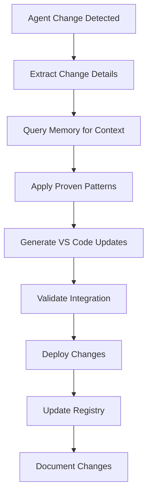

# Real-time Synchronization Capabilities

## Overview
This module provides real-time synchronization between the OpenAgentBuilder core library and VS Code prompt files, ensuring that changes to agents are immediately reflected in the VS Code integration without manual intervention.

## Core Synchronization Features

### Change Detection Engine
- **File System Monitoring**: Real-time monitoring of agent files using efficient file watchers
- **Intelligent Diffing**: Smart comparison of agent versions to identify specific changes
- **Impact Analysis**: Assess which VS Code integration components are affected by changes
- **Priority Queuing**: Queue synchronization tasks based on change impact and agent priority
- **Conflict Resolution**: Detect and resolve conflicts between concurrent changes

### Automated Sync Pipeline


### Memory-Enhanced Processing
- **Context Gathering**: Query development session for relevant synchronization background
- **Pattern Application**: Use institutional memory for optimal synchronization approaches
- **Decision Alignment**: Validate sync strategies against documented architectural principles
- **Quality Integration**: Apply TDD and quality standards to synchronization process
- **Knowledge Contribution**: Document sync insights back to knowledge base

## Synchronization Strategies

### Incremental Updates
- **Selective Regeneration**: Update only affected VS Code components rather than full regeneration
- **Dependency Tracking**: Track and update dependent prompt files automatically
- **Version Consistency**: Maintain version consistency across all integrated components
- **Rollback Capability**: Provide rollback mechanism for problematic synchronizations
- **Change Validation**: Validate each synchronization step before proceeding

### Batch Processing
- **Queue Management**: Efficiently manage multiple concurrent synchronization requests
- **Resource Optimization**: Optimize resource usage during batch synchronization operations
- **Progress Tracking**: Provide real-time progress updates for synchronization operations
- **Error Handling**: Robust error handling with detailed logging and recovery procedures
- **Performance Monitoring**: Monitor synchronization performance and optimize bottlenecks

### Conflict Resolution
```markdown
**Version Conflicts**
1. Detect version mismatches between core agents and VS Code integration
2. Query memory for successful conflict resolution patterns
3. Apply appropriate merge strategies based on change types
4. Validate resolution against quality standards
5. Update all affected components consistently

**Structural Changes**
1. Identify structural modifications in agent architecture
2. Assess impact on existing VS Code prompt file structure
3. Plan migration strategy using proven patterns
4. Execute structural updates with validation at each step
5. Update documentation and user guidance accordingly

**Reference Integrity**
1. Detect broken references due to agent reorganization
2. Map old references to new structure using change history
3. Update all affected cross-references systematically
4. Validate reference integrity across entire integration
5. Document reference changes for future maintenance
```

## Real-time Event Processing

### Event Stream Management
- **Change Event Capture**: Capture all relevant change events from the core library
- **Event Filtering**: Filter events to focus on VS Code integration-relevant changes
- **Event Enrichment**: Enrich events with metadata and context from institutional memory
- **Event Routing**: Route events to appropriate synchronization handlers
- **Event Persistence**: Persist events for audit trails and rollback capabilities

### Processing Workflows
```yaml
Agent_Updated:
  trigger: file_modified
  process:
    - extract_change_metadata
    - query_development_session_context
    - apply_proven_sync_patterns
    - generate_vs_code_updates
    - validate_integration_quality
    - deploy_synchronized_changes
    - update_knowledge_base

New_Agent_Added:
  trigger: new_file_detected
  process:
    - discover_agent_structure
    - assess_integration_requirements
    - query_similar_agent_patterns
    - create_vs_code_integration
    - validate_new_integration
    - register_agent_in_system
    - document_integration_approach

Agent_Removed:
  trigger: file_deleted
  process:
    - identify_affected_integrations
    - plan_graceful_deprecation
    - execute_cleanup_procedures
    - update_user_documentation
    - remove_from_registry
    - archive_integration_artifacts
```

## Performance Optimization

### Efficient Processing
- **Lazy Loading**: Load agent content only when synchronization is required
- **Caching Strategy**: Cache frequently accessed agent data and transformation results
- **Parallel Processing**: Process independent synchronization tasks in parallel
- **Resource Pooling**: Pool computational resources for optimal utilization
- **Debouncing**: Prevent unnecessary synchronizations from rapid successive changes

### Scalability Features
- **Load Balancing**: Distribute synchronization load across available resources
- **Queue Prioritization**: Prioritize critical synchronizations over routine updates
- **Resource Monitoring**: Monitor system resources and adjust processing accordingly
- **Adaptive Throttling**: Throttle synchronization rate based on system performance
- **Horizontal Scaling**: Support for distributed synchronization processing

## Quality Assurance Integration

### Continuous Validation
- **Pre-sync Validation**: Validate changes before beginning synchronization process
- **In-process Monitoring**: Monitor synchronization quality during execution
- **Post-sync Verification**: Verify synchronization results meet quality standards
- **Integration Testing**: Automated testing of synchronized VS Code integrations
- **Rollback Triggers**: Automatic rollback on quality threshold violations

### TDD Integration
- **Test-First Sync**: Define expected synchronization outcomes before implementation
- **Automated Testing**: Comprehensive test suite for all synchronization scenarios
- **Quality Metrics**: Track synchronization quality metrics over time
- **Continuous Improvement**: Use test results to improve synchronization algorithms
- **Regression Prevention**: Prevent regression in synchronization quality

## Monitoring and Observability

### Real-time Dashboards
- **Sync Status**: Real-time view of synchronization queue and processing status
- **Performance Metrics**: Live performance metrics for synchronization operations
- **Error Tracking**: Real-time error detection and alerting
- **Resource Utilization**: Monitor computational resource usage during sync operations
- **Quality Indicators**: Live quality metrics for synchronized integrations

### Historical Analysis
- **Sync History**: Complete history of all synchronization operations
- **Performance Trends**: Analyze synchronization performance trends over time
- **Error Patterns**: Identify and analyze recurring error patterns
- **Usage Analytics**: Track which agents and features are most frequently synchronized
- **Optimization Opportunities**: Identify opportunities for sync process optimization

---
**Related Modules**: 
- @modules/capabilities/dynamic-discovery-capabilities.md
- @modules/capabilities/evolutionary-capabilities.md
- @modules/memory/memory-integration.md
- @modules/metrics/performance-metrics.md
