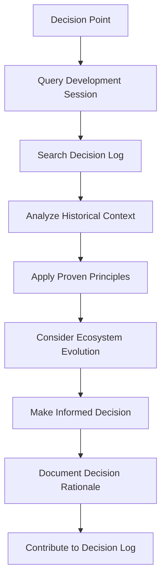

# Decision Log Access

## Overview
This module provides access to OpenAgentBuilder's institutional decision log, enabling the VS Code SDK Integration Agent to maintain consistency with established architectural decisions and contribute new decisions from integration development.

## Decision Categories

### Architectural Decisions
```yaml
Integration_Architecture:
  modular_design_principle:
    decision: "Use modular architecture for VS Code integration"
    rationale: "Enables independent development and maintenance of integration components"
    date: "2025-06-05"
    status: "active"
    impact: "high"
    
  memory_enhanced_workflow:
    decision: "Integrate institutional memory into all major workflows"
    rationale: "Leverages accumulated knowledge for better decision making"
    date: "2025-06-06"
    status: "active"
    impact: "high"
    
  evolutionary_capability:
    decision: "Build evolutionary adaptation into integration architecture"
    rationale: "Supports on-the-fly ecosystem evolution and growth"
    date: "2025-06-06"
    status: "active"
    impact: "high"

Quality_Standards:
  tdd_integration:
    decision: "Integrate TDD principles throughout integration development"
    rationale: "Ensures high quality and maintainable integration code"
    date: "2025-06-05"
    status: "active"
    impact: "medium"
    
  continuous_validation:
    decision: "Implement continuous validation for all integration components"
    rationale: "Prevents quality degradation and ensures reliability"
    date: "2025-06-06"
    status: "active"
    impact: "medium"

Platform_Integration:
  vscode_prompt_files:
    decision: "Use VS Code prompt files as primary integration mechanism"
    rationale: "Native VS Code feature providing optimal integration experience"
    date: "2025-06-05"
    status: "active"
    impact: "high"
    
  real_time_synchronization:
    decision: "Implement real-time synchronization between agents and VS Code"
    rationale: "Ensures VS Code integration stays current with agent evolution"
    date: "2025-06-06"
    status: "active"
    impact: "high"
```

### Technology Decisions
```yaml
Synchronization_Technology:
  file_system_watchers:
    decision: "Use file system watchers for change detection"
    rationale: "Provides efficient real-time change detection with minimal overhead"
    date: "2025-06-06"
    status: "active"
    impact: "medium"
    
  event_driven_processing:
    decision: "Use event-driven architecture for synchronization pipeline"
    rationale: "Enables scalable and responsive synchronization processing"
    date: "2025-06-06"
    status: "active"
    impact: "medium"

Performance_Optimization:
  lazy_loading_strategy:
    decision: "Implement lazy loading for agent content"
    rationale: "Optimizes memory usage and improves startup performance"
    date: "2025-06-06"
    status: "active"
    impact: "low"
    
  caching_implementation:
    decision: "Implement intelligent caching for frequently accessed data"
    rationale: "Improves performance for repeated operations"
    date: "2025-06-06"
    status: "active"
    impact: "medium"
```

## Decision Access Protocol

### Decision Query Process
```markdown
**Decision Lookup Workflow**
1. Identify architectural or technical decision point
2. Query decision log for relevant existing decisions
3. Analyze decision context and applicability
4. Validate current approach against established decisions
5. Identify any conflicts or inconsistencies
6. Resolve conflicts through principled decision-making process

**Query Categories**
- **Architectural Consistency**: Ensure architectural choices align with established principles
- **Technology Selection**: Validate technology choices against documented decisions
- **Quality Standards**: Apply established quality criteria to current work
- **Performance Targets**: Align performance goals with documented requirements
- **Integration Approach**: Follow established integration methodologies
```

### Decision Validation
```yaml
Validation_Process:
  consistency_check:
    - compare_with_established_decisions
    - identify_conflicts_or_inconsistencies
    - assess_impact_of_deviations
    - validate_rationale_for_changes
    
  principle_alignment:
    - verify_alignment_with_architectural_principles
    - ensure_consistency_with_quality_standards
    - validate_performance_target_alignment
    - confirm_integration_methodology_compliance
    
  context_assessment:
    - evaluate_decision_context_relevance
    - assess_current_situation_applicability
    - consider_ecosystem_evolution_impact
    - validate_timing_and_priority_factors
```

## Decision Contribution

### New Decision Documentation
```markdown
**Decision Documentation Process**
1. Identify significant architectural or technical decision
2. Document decision context, options, and rationale
3. Assess decision impact on integration and ecosystem
4. Validate decision against established principles
5. Contribute decision to institutional decision log
6. Enable decision discovery for future reference

**Decision Documentation Template**
- **Decision Title**: Clear, descriptive decision name
- **Context**: Situation requiring the decision
- **Options Considered**: Alternative approaches evaluated
- **Decision Made**: Selected approach and rationale
- **Impact Assessment**: Expected impact on system and ecosystem
- **Success Criteria**: Measurable criteria for decision success
- **Review Date**: Scheduled review for decision effectiveness
```

### Decision Evolution
```yaml
Decision_Evolution_Process:
  effectiveness_review:
    - assess_decision_outcomes_against_criteria
    - evaluate_impact_on_integration_quality
    - measure_performance_and_reliability_effects
    - analyze_ecosystem_adaptation_success
    
  adaptation_consideration:
    - identify_changing_context_factors
    - evaluate_new_options_and_technologies
    - assess_evolution_requirements
    - consider_ecosystem_growth_impact
    
  decision_refinement:
    - refine_decision_based_on_experience
    - update_rationale_with_new_insights
    - adjust_implementation_approach
    - enhance_success_criteria_and_metrics
```

## Memory-Enhanced Decision Making

### Contextual Decision Support


### Learning Integration
- **Decision Pattern Recognition**: Recognize patterns in successful decision-making
- **Context Learning**: Learn which decision approaches work best in specific contexts
- **Outcome Prediction**: Predict decision outcomes based on historical data
- **Principle Evolution**: Evolve decision-making principles based on experience
- **Wisdom Accumulation**: Accumulate decision-making wisdom over time

## Decision Consistency Management

### Consistency Validation
- **Principle Adherence**: Ensure decisions adhere to established architectural principles
- **Standard Compliance**: Validate decisions comply with documented quality standards
- **Integration Alignment**: Ensure decisions align with integration methodology
- **Performance Consistency**: Maintain consistency with performance requirements
- **Evolution Support**: Ensure decisions support evolutionary capability requirements

### Conflict Resolution
```markdown
**Conflict Resolution Process**
1. Identify conflicts between current decision and established decisions
2. Analyze context differences that might justify deviation
3. Assess impact of conflict on system integrity and quality
4. Develop resolution strategy that maintains principle consistency
5. Document resolution rationale and update decision log
6. Validate resolution effectiveness over time

**Resolution Strategies**
- **Principle Refinement**: Refine principles to accommodate new understanding
- **Context Specification**: Specify contexts where different approaches apply
- **Decision Evolution**: Evolve previous decisions based on new insights
- **Exception Documentation**: Document justified exceptions with clear rationale
- **Standard Updates**: Update standards to reflect evolved understanding
```

## Quality Assurance for Decision Access

### Decision Accuracy
- **Information Validation**: Ensure accessed decision information is accurate and current
- **Context Relevance**: Validate relevance of historical decisions to current context
- **Impact Assessment**: Accurately assess impact of decisions on current work
- **Consistency Checking**: Verify consistency between related decisions
- **Currency Maintenance**: Ensure decision information reflects current status

### Decision Application Quality
- **Appropriate Application**: Ensure decisions are applied in appropriate contexts
- **Implementation Fidelity**: Maintain fidelity to decision intent during implementation
- **Adaptation Appropriateness**: Ensure decision adaptations are justified and documented
- **Outcome Tracking**: Track outcomes of decision application for future learning
- **Feedback Integration**: Integrate feedback on decision effectiveness

---
**Related Modules**: 
- @modules/memory/memory-integration.md
- @modules/memory/development-session-context.md
- @modules/capabilities/evolutionary-capabilities.md
