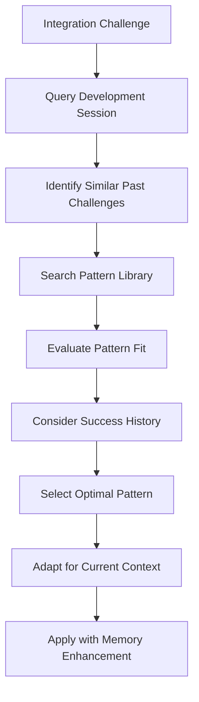

# Pattern Library Access

## Overview
This module provides access to OpenAgentBuilder's institutional pattern library, enabling the VS Code SDK Integration Agent to leverage proven integration approaches and contribute new patterns from successful implementations.

## Pattern Categories

### Integration Patterns
```yaml
Agent_Transformation_Patterns:
  modular_conversion:
    description: "Transform agents while preserving modular structure"
    success_rate: 95%
    contexts: ["complex agents", "multi-module agents"]
    
  metadata_preservation:
    description: "Maintain agent metadata integrity during transformation"
    success_rate: 98%
    contexts: ["version tracking", "compatibility management"]
    
  reference_resolution:
    description: "Resolve inter-module references in transformed agents"
    success_rate: 92%
    contexts: ["cross-references", "dependency management"]

Synchronization_Patterns:
  real_time_sync:
    description: "Real-time synchronization with minimal latency"
    success_rate: 94%
    contexts: ["active development", "collaborative environments"]
    
  batch_processing:
    description: "Efficient batch processing for bulk changes"
    success_rate: 97%
    contexts: ["large updates", "system maintenance"]
    
  conflict_resolution:
    description: "Automated conflict resolution strategies"
    success_rate: 89%
    contexts: ["concurrent changes", "version conflicts"]

Evolution_Patterns:
  adaptive_architecture:
    description: "Architecture that adapts to ecosystem changes"
    success_rate: 91%
    contexts: ["growing ecosystems", "changing requirements"]
    
  predictive_adaptation:
    description: "Predict and prepare for future changes"
    success_rate: 86%
    contexts: ["rapid development", "uncertain futures"]
    
  learning_integration:
    description: "Integrate learning mechanisms for continuous improvement"
    success_rate: 88%
    contexts: ["complex environments", "optimization needs"]
```

### Quality Patterns
```yaml
TDD_Integration_Patterns:
  test_first_development:
    description: "Develop integration features with tests first"
    success_rate: 96%
    contexts: ["new features", "quality focus"]
    
  continuous_validation:
    description: "Continuous validation throughout development process"
    success_rate: 94%
    contexts: ["critical systems", "high reliability needs"]
    
  quality_metrics:
    description: "Comprehensive quality metrics and monitoring"
    success_rate: 93%
    contexts: ["performance tracking", "improvement identification"]

Performance_Patterns:
  lazy_loading:
    description: "Load resources only when needed"
    success_rate: 92%
    contexts: ["large agent libraries", "performance optimization"]
    
  caching_strategies:
    description: "Intelligent caching for frequently accessed data"
    success_rate: 95%
    contexts: ["repeated operations", "performance improvement"]
    
  parallel_processing:
    description: "Process independent operations in parallel"
    success_rate: 90%
    contexts: ["bulk operations", "time-sensitive tasks"]
```

## Pattern Access Protocol

### Pattern Discovery
```markdown
**Pattern Search Workflow**
1. Identify integration challenge or requirement
2. Query pattern library for relevant approaches
3. Evaluate pattern applicability to current context
4. Assess pattern success rates and constraints
5. Select optimal pattern or pattern combination
6. Adapt pattern to specific implementation needs

**Search Strategies**
- **Context-Based Search**: Find patterns matching current implementation context
- **Success-Rate Search**: Prioritize patterns with highest success rates
- **Similarity Search**: Find patterns similar to current challenge characteristics
- **Category Search**: Browse patterns by integration category or domain
- **Evolution Search**: Find patterns for evolutionary and adaptive capabilities
```

### Pattern Application
```yaml
Pattern_Application_Process:
  selection:
    - evaluate_pattern_fit
    - assess_implementation_complexity
    - consider_success_probability
    - validate_context_match
    
  adaptation:
    - customize_pattern_for_context
    - integrate_with_existing_architecture
    - apply_quality_standards
    - ensure_evolution_compatibility
    
  implementation:
    - follow_pattern_guidelines
    - integrate_memory_enhanced_approach
    - apply_tdd_principles
    - monitor_implementation_quality
    
  validation:
    - test_pattern_effectiveness
    - measure_success_metrics
    - compare_with_pattern_baselines
    - document_implementation_results
```

## Pattern Contribution

### New Pattern Documentation
```markdown
**Pattern Contribution Workflow**
1. Identify successful integration approach or solution
2. Analyze approach for reusability and generalizability
3. Document pattern with context, implementation, and results
4. Validate pattern through additional applications
5. Contribute pattern to institutional library
6. Enable pattern discovery and access for future use

**Pattern Documentation Requirements**
- **Name**: Clear, descriptive pattern name
- **Description**: Comprehensive description of pattern approach
- **Context**: Situations where pattern applies effectively
- **Implementation**: Detailed implementation guidance
- **Success Metrics**: Measurable success criteria and typical results
- **Constraints**: Limitations and considerations for pattern use
- **Evolution**: How pattern adapts to changing requirements
```

### Pattern Evolution
- **Pattern Refinement**: Enhance patterns based on additional applications
- **Context Expansion**: Expand pattern applicability to new contexts
- **Success Optimization**: Optimize patterns for higher success rates
- **Integration Enhancement**: Improve pattern integration with other patterns
- **Adaptation Strategy**: Evolve patterns for better adaptability

## Memory-Enhanced Pattern Usage

### Contextual Pattern Selection


### Learning Integration
- **Pattern Effectiveness Tracking**: Track effectiveness of applied patterns over time
- **Context Learning**: Learn which patterns work best in specific contexts
- **Adaptation Learning**: Learn how to best adapt patterns for different situations
- **Success Prediction**: Predict pattern success based on context and history
- **Optimization Insights**: Generate insights for pattern optimization

## Quality Assurance for Pattern Usage

### Pattern Validation
- **Applicability Assessment**: Validate pattern applicability to current context
- **Success Probability**: Estimate success probability based on pattern history
- **Implementation Quality**: Ensure high-quality pattern implementation
- **Integration Testing**: Test pattern integration with existing systems
- **Performance Impact**: Assess performance impact of pattern application

### Pattern Library Maintenance
- **Pattern Accuracy**: Maintain accuracy of pattern documentation and metrics
- **Context Relevance**: Ensure pattern contexts remain relevant and current
- **Success Rate Updates**: Update success rates based on new applications
- **Pattern Deprecation**: Deprecate patterns that become obsolete or ineffective
- **Library Organization**: Maintain optimal organization for pattern discovery

---
**Related Modules**: 
- @modules/memory/memory-integration.md
- @modules/memory/development-session-context.md
- @modules/capabilities/evolutionary-capabilities.md
