# Copilot Customization Workflow

This diagram shows how to use instruction files and prompt files in VS Code for GitHub Copilot customization.

```mermaid
flowchart TD
    %% Main Entry Point
    START([🚀 Start: Customize Copilot]) --> ENABLE{🔧 Enable Prompt Files?}
    ENABLE -->|✅ Yes| SETTING[⚙️ Set chat.promptFiles = true]
    ENABLE -->|❌ No| END_DEFAULT([Use Default Behavior])
    
    SETTING --> METHOD{📋 Choose Method}
    
    %% Three Main Paths with Icons
    METHOD -->|📄 Instructions| INST_TYPE{📝 Instruction Type?}
    METHOD -->|⚡ Prompts| PROMPT_SCOPE{🌍 Prompt Scope?}
    METHOD -->|⚙️ Settings| SETTINGS_START[Open Settings JSON]
    
    %% Instruction Files Path - Global
    INST_TYPE -->|🏢 Workspace Global| GLOBAL_PATH[Global Instructions Path]
    GLOBAL_PATH --> GLOBAL_CREATE[📁 .github/copilot-instructions.md]
    GLOBAL_CREATE --> GLOBAL_ENABLE[✅ Enable useInstructionFiles]
    GLOBAL_ENABLE --> GLOBAL_WRITE[✏️ Write Markdown Content]
    GLOBAL_WRITE --> GLOBAL_AUTO[🤖 Auto-applied to all chats]
    GLOBAL_AUTO --> INST_READY([✨ Instructions Ready])
    
    %% Instruction Files Path - Scoped
    INST_TYPE -->|🎯 Scoped/Specific| SCOPED_PATH[Scoped Instructions Path]
    SCOPED_PATH --> SCOPE_CHOICE{📍 Location?}
    SCOPE_CHOICE -->|🏢 Workspace| WS_CREATE[📁 .github/instructions/*.md]
    SCOPE_CHOICE -->|👤 User Profile| USER_CREATE[👤 Command: New Instruction File]
    
    WS_CREATE --> AUTHOR[✏️ Author File]
    USER_CREATE --> SYNC[🔄 Optional: Settings Sync]
    SYNC --> AUTHOR
    
    AUTHOR --> FRONT_MATTER[📋 Add Front Matter + Content]
    FRONT_MATTER --> USAGE{🎯 Usage Method?}
    USAGE -->|✋ Manual| MANUAL[➕ Add Context → Instructions]
    USAGE -->|🤖 Auto| AUTO[📌 Use applyTo pattern]
    
    MANUAL --> INST_READY
    AUTO --> INST_READY
    
    %% Prompt Files Path
    PROMPT_SCOPE -->|🏢 Workspace| WS_PROMPT_PATH[Workspace Prompts]
    PROMPT_SCOPE -->|👤 User Profile| USER_PROMPT_PATH[User Prompts]
    
    WS_PROMPT_PATH --> WS_PROMPT_CREATE[📁 .github/prompts/*.prompt.md]
    USER_PROMPT_PATH --> USER_PROMPT_CREATE[👤 Command: New Prompt File]
    USER_PROMPT_CREATE --> USER_SYNC[🔄 Optional: Settings Sync]
    
    WS_PROMPT_CREATE --> PROMPT_BUILD[🔨 Build Prompt]
    USER_SYNC --> PROMPT_BUILD
    
    PROMPT_BUILD --> PROMPT_FRONT[📋 Front Matter: mode, tools, description]
    PROMPT_FRONT --> PROMPT_CONTENT[📝 Add Content + Variables]
    PROMPT_CONTENT --> PROMPT_VARS["🔧 Variables: file, selection, input"]
    PROMPT_VARS --> PROMPT_RUN{▶️ Execute How?}
    
    PROMPT_RUN -->|⌨️ Command| CMD_RUN[Command Palette: Run Prompt]
    PROMPT_RUN -->|💬 Chat| SLASH_RUN[Type /prompt-name]
    PROMPT_RUN -->|📝 Editor| PLAY_RUN[Click ▶️ Button]
    
    CMD_RUN --> PROMPT_READY([🎉 Prompt Executed])
    SLASH_RUN --> PROMPT_READY
    PLAY_RUN --> PROMPT_READY
    
    %% Settings Path
    SETTINGS_START --> SCENARIO_CHOICE{🎯 Target Scenario?}
    
    SCENARIO_CHOICE -->|💻 Code Gen| CODE_SETTING[codeGeneration.instructions]
    SCENARIO_CHOICE -->|🧪 Test Gen| TEST_SETTING[testGeneration.instructions]
    SCENARIO_CHOICE -->|👀 Review| REVIEW_SETTING[reviewSelection.instructions]
    SCENARIO_CHOICE -->|📝 Commits| COMMIT_SETTING[commitMessage.instructions]
    SCENARIO_CHOICE -->|📋 PR Desc| PR_SETTING[pullRequestDescription.instructions]
    
    CODE_SETTING --> FORMAT_CHOICE{📄 Format?}
    TEST_SETTING --> FORMAT_CHOICE
    REVIEW_SETTING --> FORMAT_CHOICE
    COMMIT_SETTING --> FORMAT_CHOICE
    PR_SETTING --> FORMAT_CHOICE
    
    FORMAT_CHOICE -->|📝 Direct| DIRECT_TEXT["Inline Text Object"]
    FORMAT_CHOICE -->|📁 File| FILE_REF["File Reference Object"]
    
    DIRECT_TEXT --> SETTINGS_READY([⚙️ Settings Applied])
    FILE_REF --> SETTINGS_READY
    
    %% Enhanced Styling with better contrast and readability
    classDef startNode fill:#4CAF50,stroke:#2E7D32,stroke-width:3px,color:#FFFFFF,font-weight:bold
    classDef endNode fill:#2196F3,stroke:#0D47A1,stroke-width:3px,color:#FFFFFF,font-weight:bold
    classDef decision fill:#FF9800,stroke:#E65100,stroke-width:2px,color:#FFFFFF,font-weight:bold
    classDef process fill:#9C27B0,stroke:#4A148C,stroke-width:2px,color:#FFFFFF
    classDef important fill:#00BCD4,stroke:#00695C,stroke-width:2px,color:#FFFFFF,font-weight:bold
    classDef path fill:#E91E63,stroke:#880E4F,stroke-width:2px,color:#FFFFFF
    classDef setting fill:#795548,stroke:#3E2723,stroke-width:2px,color:#FFFFFF
    
    class START startNode
    class END_DEFAULT,INST_READY,PROMPT_READY,SETTINGS_READY endNode
    class ENABLE,METHOD,INST_TYPE,SCOPE_CHOICE,USAGE,PROMPT_SCOPE,PROMPT_RUN,SCENARIO_CHOICE,FORMAT_CHOICE decision
    class GLOBAL_CREATE,WS_CREATE,USER_CREATE,AUTHOR,WS_PROMPT_CREATE,USER_PROMPT_CREATE,PROMPT_BUILD,FRONT_MATTER,PROMPT_FRONT important
    class GLOBAL_PATH,SCOPED_PATH,WS_PROMPT_PATH,USER_PROMPT_PATH path
    class SETTING,GLOBAL_ENABLE,SYNC,USER_SYNC,SETTINGS_START setting
```

## Key Features of This Workflow:

### 1. Instruction Files
- **Workspace-wide**: `.github/copilot-instructions.md` - automatically applied
- **Scoped**: `.instructions.md` files for specific tasks, can be workspace or user-level
- **Usage**: Manual attachment or automatic via `applyTo` property

### 2. Prompt Files (Experimental)
- **Location**: `.github/prompts` (workspace) or user data folder
- **Features**: Variables, file references, Front Matter configuration
- **Execution**: Command palette, chat input with `/`, or editor play button

### 3. Settings-Level Instructions
- **Scenarios**: Code generation, testing, review, commits, PR descriptions
- **Format**: Array of objects with `text` or `file` properties
- **Scope**: User or workspace settings

### 4. Best Practices
- Keep instruction files short and self-contained
- Use `applyTo` for automatic application
- Reference other files to keep prompts clean
- Enable Settings Sync for cross-device consistency
- Avoid conflicting instructions when combining methods

## Key Improvements Made:

### 1. 🎨 **Visual Enhancements**
- **Icons**: Added relevant emojis to make nodes more recognizable
- **Color Coding**: Different colors for different types of actions
- **Better Contrast**: High contrast colors for better readability
- **Font Weight**: Bold text for important nodes

### 2. 📝 **Content Simplification**
- **Shorter Labels**: Reduced verbose descriptions
- **Key Actions**: Focused on essential steps
- **Clear Paths**: Three distinct workflows are easier to follow

### 3. 🔄 **Flow Improvements**
- **Logical Grouping**: Related steps are visually connected
- **Decision Points**: Clear diamond shapes for choices
- **End States**: Distinct styling for completion nodes

### 4. 🎯 **Three Main Paths**

#### **📄 Instruction Files**
- **Global**: Single workspace file auto-applied to all chats
- **Scoped**: Multiple files with manual/automatic application

#### **⚡ Prompt Files** (Experimental)
- Reusable prompts with variables
- Multiple execution methods

#### **⚙️ Settings-Level Instructions**
- Direct JSON configuration
- Scenario-specific instructions

### 5. 💡 **Usage Tips**
- Each path shows clear entry and exit points
- Optional features are clearly marked
- Common patterns are highlighted

## Color Legend:
- 🟢 **Green**: Start nodes
- 🔵 **Blue**: End/completion nodes  
- 🟠 **Orange**: Decision points
- 🟣 **Purple**: Process steps
- 🔷 **Cyan**: Important actions
- 🔴 **Pink**: Path indicators
- 🟤 **Brown**: Settings/configuration

This diagram is now much more scannable and easier to understand at a glance while maintaining all the important technical details.